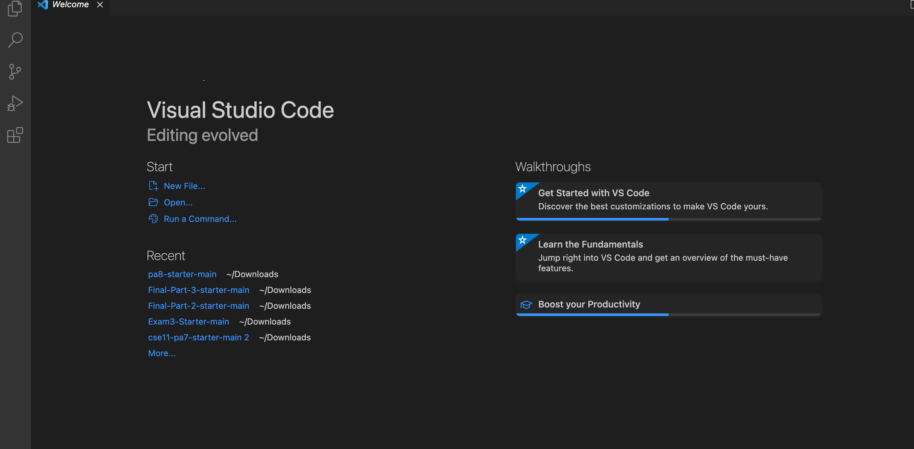

# LAB REPORT 1
## Installing VScode

## Remotely Connecting

## Trying Some Commands

## Moving Files with scp

## Setting an SSH Key

## Optimizing Remote Running

[Link](https://www.tesla.com/modely)