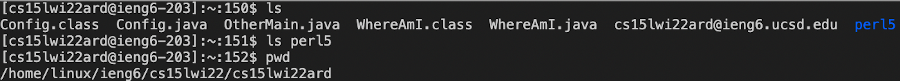

# LAB REPORT 1
## Installing VScode
I accessed the Virtual Studio Code website using the link [VSCode]( https://code.visualstudio.com/)

Since I use a MacBook,I downloaded the Mac Universal with a Mac Operating System (MacOS) and a stable build.
 Upon installation,I was able to open a window that looked similar to the image below:

## Remotely Connecting
I accessed the Account Lookup Page via the [AccountLookup](https://sdacs.ucsd.edu/~icc/index.php).
After entering the username and Student ID,it will lead to a page that gives us the "**Account Lookup Results**".Under "Resources",I looked at the course specific code for CSE 15l.
After opening a new terminal in VS Code,I entered the command "ssh" followed by the course specific account:

Since it's the first time connecting to the new server,it will produce a message similar to:

I said "yes" to this message.After entering it,I was logged in and my terminal was connected to the server.

## Trying Some Commands
In this task,I ran different commands such as ls,ls directory,pwd,cp and ls -lat.
In the image below ls and ls -lat was used.The 'ls' command lists all the files in the current directory.The ls -lat gives a more detailed account of the files in different directories including those who have access,source,and the time it has been modified.

ls directory prints the contents in that directory.The "pwd" prints the working directory and "cp" copies the information in the files to the server(in this case,the ieng6 computer)

## Moving Files with scp
For copying files from my computer to a remote computer,I entered the command "scp" followed by the file(WhereAmI.java) that I wanted to copy to the remote computer(server) and the course specific info in the terminal of the directory.

After this step,I logged into the ieng6 computer using the "ssh" command and used ls and noticed that the file is in the home directory of the server.Then,I ran the code using the "javac" and "java" commands.
-scp.png)

## Setting an SSH Key
In order to prevent entering the password everytime we login or want to copy the files to the ieng6 computer,I used the "ssh keygen" that creates a pair of public key and private key.

The keys will cause the "ssh" to use the pair of files instead of the password.

## Optimizing Remote Running
I made a local edit to the file(WhereAmI.java).The change I made to the file was replacing user.home by user.name.

In order to optimize the remote running,I used the command "ls" following the ssh commands.After that step,I also listed all the cp,javac and java statements in a single line using semi colons.These two procedures really helped speeden the process.

