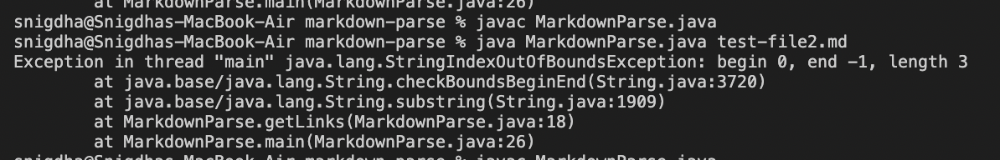

# LAB REPORT 2
The code in the MarkdownParse.java produces an output that lies between `(` and `)`,given these brackets lie at an index greater than the index of `[` and `]`
## Test file with an **Image reference**

**Symptom of the failure**

**Link of the test file**
[Test-File-Link](test-file3.md)
## RELATIONSHIP BETWEEN THE BUG,SYMPTOM AND FAILURE-INDUCING INPUT
The only difference between image link and the other file links is the character `!` before the `[]` for image links.Since the bug in the code is not going to consider the character `!` before the `[]`,the sympton only shows `[abc.png]`.The mon-consideration of the `!` is addressed while writing a code to prevent the failure-inducing input.

## Test file that doesn't contain `[`,`]`,`(`,`)`

SYMPTOM OF THE FAILURE 

**Link of the test file**
[Test-File-Link](test-file1.md)
## RELATIONSHIP BETWEEN THE BUG,SYMPTOM AND FAILURE-INDUCING INPUT
The bug is that the program doesn't take into account the possibility of the absence of `[`,`]`,`)`,and`(`in a test file.This leads to a symptom of the index out of bounds error.The absence of `[` leads to the value of nextOpenBracket to take the default value -1.
## Test file that has `(` before `[` and not after

SYMPTOM OF THE FAILURE 

**Link of the test file**
[Test-File-Link](test-file2.md)
## RELATIONSHIP BETWEEN THE BUG,SYMPTOM AND FAILURE-INDUCING INPUT
The bug is that the program doesn't take into account the possibility of the presence of `(`between `[` and `]`in a test file.This leads to a symptom of the index out of bounds error.Since we try to find `(` from `]` leads to the value of openParen to take the default value -1.