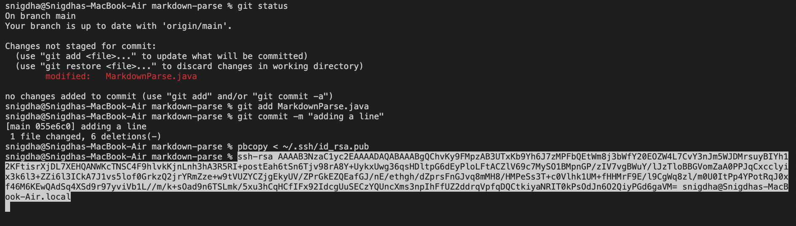
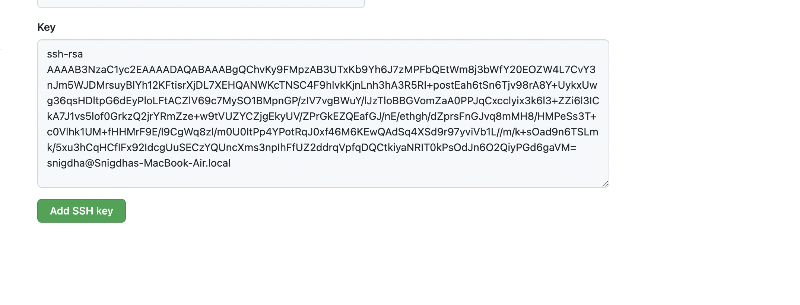
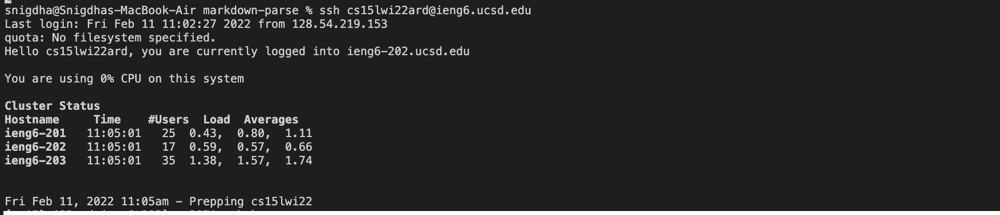
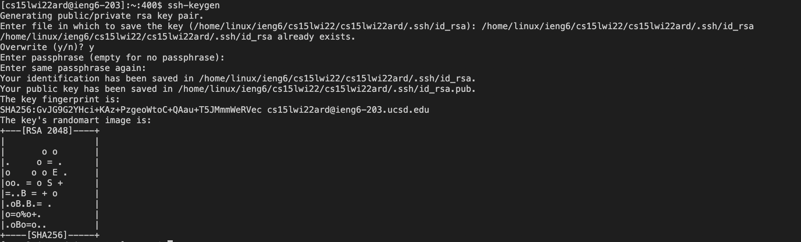
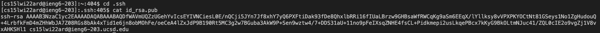
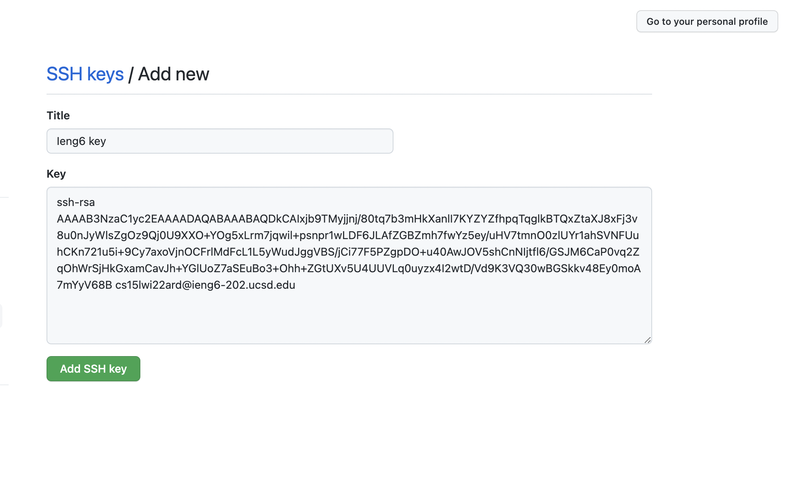
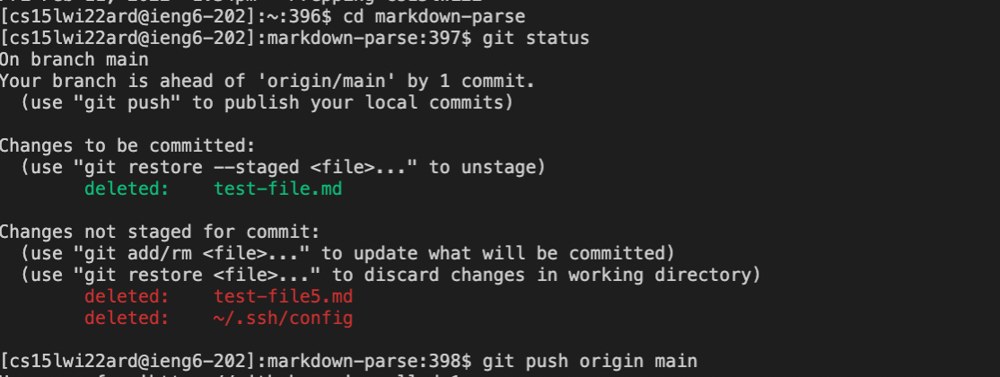
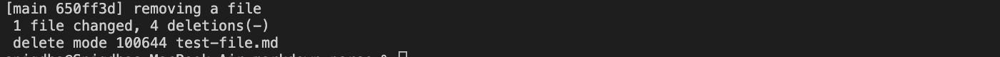

# LAB REPORT 3
## SET UP GITHUB ACCESS FROM IENG6
Prior logging in to the student account,I used `pbcopy < ~/.ssh/id_rsa.pub` to copy the ssh key to the clipboard.In github,I went to SSH and GPG keys on the settings page.I created a new SSH key with the public key received from entering the `pbcopy < ~/.ssh/id_rsa.pub` on the command line.

Then,I logged into the student account using the `ssh` function followed by the ieng6 account ID. 

After logging in to the ieng6 account,I obtained the public and private key pair using the `ssh keygen`.The private key is stored in (/home/linux/ieng6/cs15lwi22/cs15lwi22ard/.ssh/id_rsa) on the user account.The public key is stored in (/home/linux/ieng6/cs15lwi22/cs15lwi22ard/.ssh/id_rsa.pub) on the user account.

I used `cat id_rsa.pub` to copy the ssh key to the clipboard.In github,I went to SSH and GPG keys on the settings page.I created a new SSH key with the public key received from entering the `cat id_rsa.pub` on the command line.
The public key on the github page looks like the image below:

I deleted one of the test files from the markdown-parse repository from the Virtual Studio Code.I wanted to commit the deletion of the file 'test-file.md' to main. I used the `git push origin main` to commit the change.The change has been committed to the [link](https://github.com/sallada1/markdown-parse.git)

