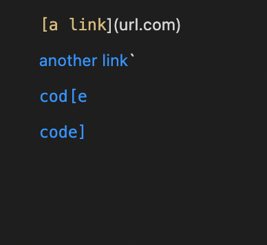
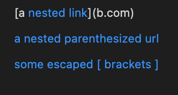
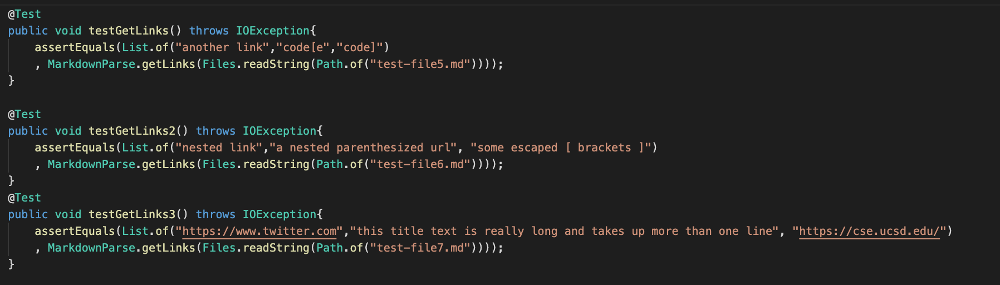
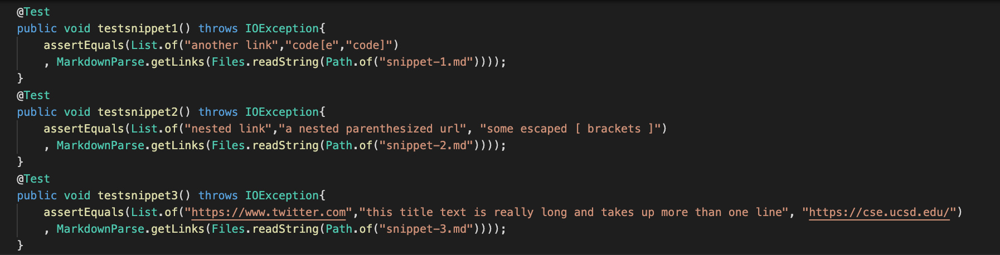
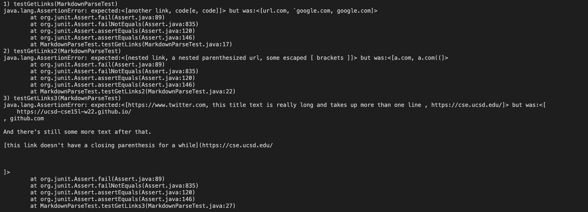
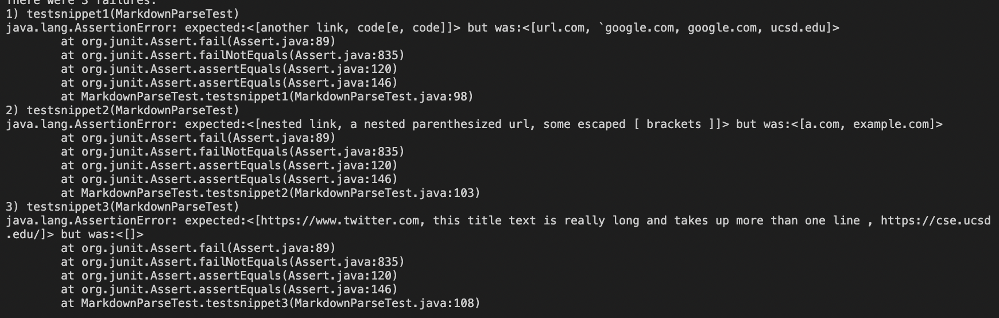
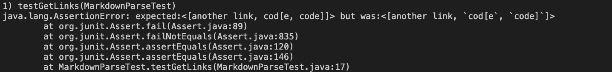
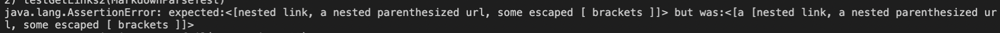
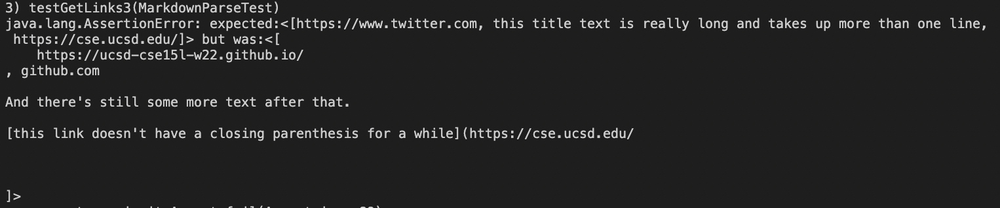

# LAB REPORT 4
## Links to the personal and the reviewed markdown-parse repository 
Link to my markdown-parse repository : [Mylink](https://github.com/sallada1/markdown-parse)

Link to the reviewed markdown-parse repository : [Reviewedlink](https://github.com/pvijay03/markdown-parse)

## Deciding the output based on the VS Code Preview
### Preview of the snippet-1

### Preview of the snippet-2

### Preview of the snippet-3

## The code of the test cases in MarkdownParseTest.java 

### My MarkdownParseTest.java file test cases
The three test cases failed

### Reviewed MarkdownParseTest.java file test cases
The three test cases failed

## Corresponding output 

### Terminal output after running the JUnit tests
*MY OUTPUT* 

*REVIEWED OUTPUT*

## SNIPPET-1 
Yes,there's a small change in the MarkdownParse.java file that could run the snippet-1.

By replacing the `toReturn.add(markdown.substring(openParen + 1,closeParen)` to 
  ``toReturn.add(markdown.substring(nextOpenBracket + 1,nextCloseBracket).replace("`",""))`` and  `](` to `]` in the nextCloseBracket,the snippet-1 test case passes.
  The ``.replace("`","")`` removes the backticks present in the test case and places an empty string instead.

## SNIPPET-2
Yes,there's a small change in the MarkdownParse.java file that could run the snippet-2.
By adding `.replace("\\",""))` to `toReturn.add(markdown.substring(nextOpenBracket + 1,nextCloseBracket)`,the snippet-2 test removes the backslashes that were previously present in the output.

However,there's an additional string `a [`.We could check if `markdown.substring(nextOpenBracket + 1,nextCloseBracket)` contains `[` and replace the string in between the two `[` with an empty string for this test to pass.This minimal change could help pass this specific test case.
However,for all related cases that is nest parentheses, brackets, and escaped brackets,there are a lot of possibilities that must be taken into account.There are several conditional statements or methods that must be added for all the related cases to pass.Therefore,it might take more than 10 lines.

## SNIPPET-3

No,there might be a code change greater than 10 lines to makes this program work.
For snippet-3,there's a lot of change required to the code the elements in the arraylist don't match the expected elements.Apart from those change ,we would also have to add a conditional statement such that if there are newlines present between the brackets and parentheses, then we could implement the `replaceAll("((?m)^[ \t]*\r?\n",""))` to eliminate the the empty lines.
