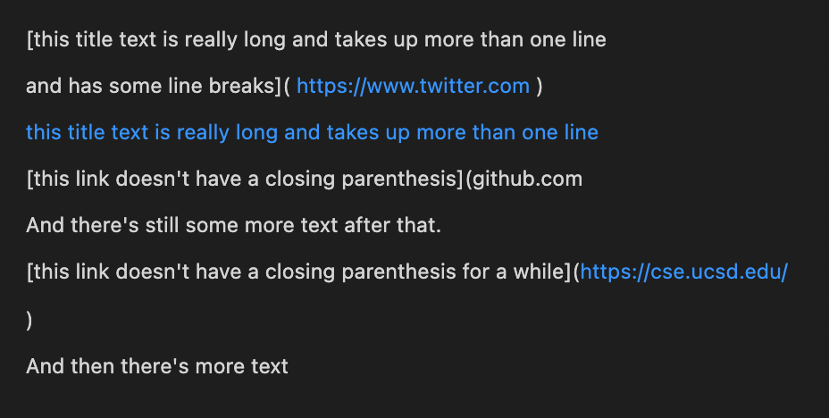

# LAB REPORT 4
## Links to the personal and the reviewed markdown-parse repository 
Link to my markdown-parse repository : [Mylink](https://github.com/sallada1/markdown-parse)

Link to the reviewed markdown-parse repository : [Reviewedlink](https://github.com/pvijay03/markdown-parse)

## Deciding the output based on the VS Code Preview
### Preview of the snippet-1

### Preview of the snippet-2

### Preview of the snippet-3

## The code of the test cases in MarkdownParseTest.java 

### My MarkdownParseTest.java file test cases

### Reviewed MarkdownParseTest.java file test cases

## Corresponding output 

### Terminal output after running the JUnit tests
*MY OUTPUT* 

*REVIEWED OUTPUT*

For each test above:
Decide on what it should produce by using either VScode preview or the CommonMark demo site
Showing the code in MarkdownParseTest.java for how you turned it into a test
For your implementation, the corresponding output when running the tests; if it passed, say so. If it didn’t pass, show the specific part of the JUnit output that shows the test failure.
For the implementation you reviewed, the corresponding output when running the tests; if it passed, say so. If it didn’t pass, show the specific part of the JUnit output that shows the test failure.
Answer the following questions with 2-3 sentences each:
Do you think there is a small (<10 lines) code change that will make your program work for snippet 1 and all related cases that use inline code with backticks? If yes, describe the code change. If not, describe why it would be a more involved change.
Do you think there is a small (<10 lines) code change that will make your program work for snippet 2 and all related cases that nest parentheses, brackets, and escaped brackets? If yes, describe the code change. If not, describe why it would be a more involved change.
Do you think there is a small (<10 lines) code change that will make your program work for snippet 3 and all related cases that have newlines in brackets and parentheses? If yes, describe the code change. If not, describe why it would be a more involved change.