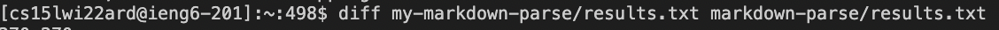
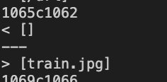
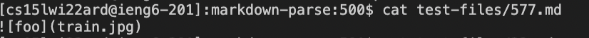
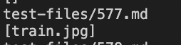
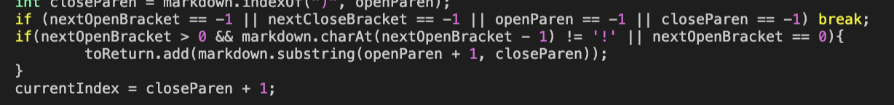
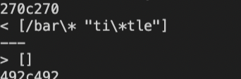
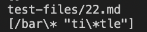
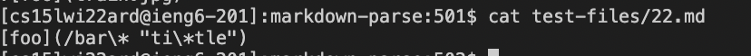
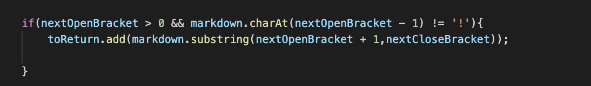
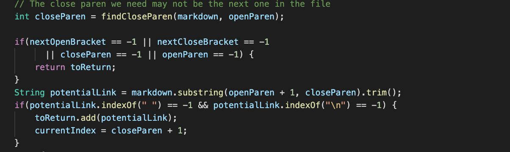

# LAB REPORT 5

The two tests from the 652 commonmark-spec tests where my implementation had different answers than the implementation in lab 9 were test-files **22** ([22.md](https://github.com/ucsd-cse15l-w22/markdown-parse/blob/main/test-files/22.md)) and **577**([577.md](https://github.com/ucsd-cse15l-w22/markdown-parse/blob/main/test-files/577.md))

## FIRST DIFFERENT IMPLEMENTATION  (Test-file: 577.md)

### The provided MarkdownParse.java class considers images as links

With the help of the `diff` followed by the *results.txt* output in the provided [markdown-parse](https://github.com/ucsd-cse15l-w22/markdown-parse) and [my-markdown-parse](https://github.com/sallada1/markdown-parse),I was able to point out the differences between the two files.

In order to figure out the file which was providing the 
output("[train.jpg]"),I used the `bash script.sh` function in the **markdown-parse** directory where the output is followed by the file name.After going through the output,it was easy to figure out which file was producing the "[train.jpg]".

With the help of the `cat` function,I confirmed the output.

For this implementation,my implementation is correct because it considers the case where the link could instead be an image.Since the only difference between the image and link is the presence of an exclamation point("!") before an opening bracket("[").

Expected output was [train.jpg] and my output was "[]".

I implemented the following if statement to prevent the misassumption of an link:

The bug in the code is that it adds the words in between the opening and closing parenthesis with a few exceptions.Since everything in the implementation of an image and link is the same between the opening and closing parenthesis,it is assumed to be a link.

## SECOND DIFFERENT IMPLEMENTATION  (Test-file: 22.md)

### The provided MarkdownParse.java class considers words with spaces as links

With the help of the `diff` followed by the *results.txt* output in the provided [markdown-parse](https://github.com/ucsd-cse15l-w22/markdown-parse) and [my-markdown-parse](https://github.com/sallada1/markdown-parse),I was able to point out the differences between the two files.

In order to figure out the file which was providing the 
output("[/bar\\* "ti\\*tle]"),I used the `bash script.sh` function in the **my-markdown-parse** directory where the output is followed by the file name.After going through the output,it was easy to figure out which file was producing  "[/bar\* "ti\*tle]".

With the help of the `cat` function,I confirmed the output.

For this implementation,my implementation is incorrect because it doesn't consider the case where there are white spaces between the opening and closing parenthesis.

Expected output was [] and my output was "[/bar\\* "ti\\*tle]".

The bug in the code is that it adds the words in between the opening and closing parenthesis.In the real world,there can't be a space(" ") between the same link.Even though it follows all the syntax rules,it can't be considered a link due to this very reason.To prevent this from taking place,`trim()` function helps in removing th unnecessary spaces between the parentheses.
# CODE TO BE CHANGED

# REFERENCE CODE THAT USED `.trim()`

